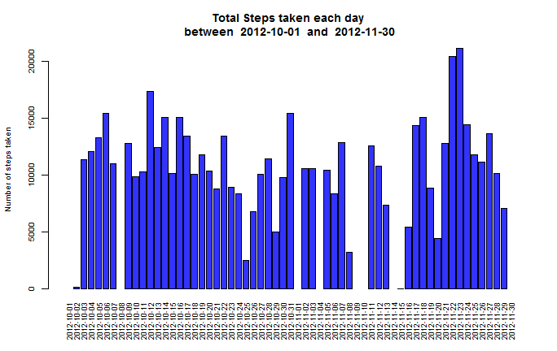
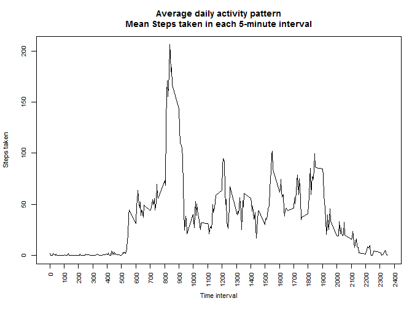
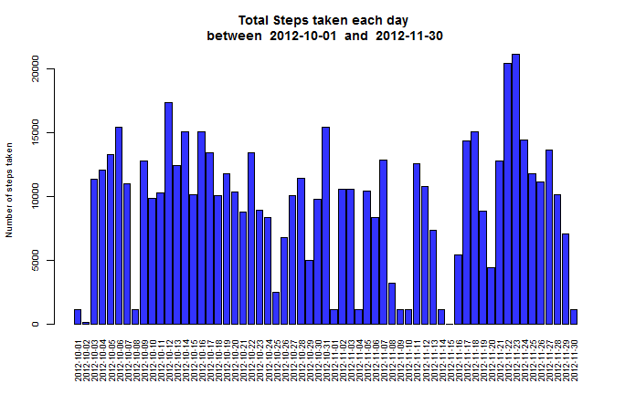
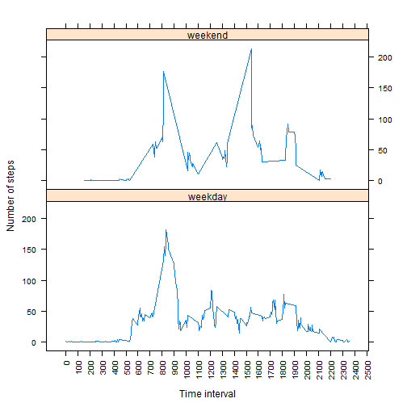

# Reproducible Research: Peer Assessment 1

Set Echo = True option for entire analysis so everybody can see entire code

```r
opts_chunk$set(echo = TRUE)
```

## Initialize
Not necessary here as dataset is in repository. But some step usually needed to document where data is coming from

myWD <- setwd("set your working directory here").


## Loading and preprocessing the data
Unzip and Load data

```r
auz <- unzip("./activity.zip")
activity <- read.csv("activity.csv", header = TRUE, 
                     colClasses = c("numeric", "character", "numeric"),
                     as.is = FALSE,
                     na.strings = "NA")
```
attach activity dataset for easier referencing

```r
attach(activity, warn.conflicts = FALSE)
```

## What is mean total number of steps taken per day?

Take Two step approach:  
1. calculate total steps per day, i.e. sum of all steps taken  
2. calculate mean across all dates, i.e. mean of resulting vector from 1.  
Don't forget to remove NA values in calculations

Step 1: calculate totals

```r
x <- date
y <- steps
total <- tapply(y, x, sum)
```

calculate date range in which steps were monitored. These will be used in the plot caption

```r
mindate <- min(activity$date, na.rm = TRUE)
maxdate <- max(activity$date, na.rm = TRUE)
```

plot histogram of total steps taken over time

```r
barplot(
      total,
      col=c("#3333ff"),
      main=paste("Total Steps taken each day \nbetween ", mindate, 
                 " and ", maxdate),
      axes = TRUE,
      ylab="Number of steps taken",
      las = 3,
      cex.axis = 0.8,
      cex.lab = 0.8,
      cex.names = 0.75
)
```

 

Step 2: Calculate Mean and Median values of total steps acrosse all days and store them in a new summary data frame.  

```r
meansteps <- mean(total, na.rm = TRUE)
mediansteps <- median(total, na.rm = TRUE)
mySummary <- data.frame(
      meansteps,
      mediansteps
      )
names(mySummary) <- c("Mean Steps", "Median Steps")

library(xtable)
xs <- xtable(mySummary, caption = "Mean and Median number of steps taken each day")
```

Print Mean and Median summary table.

```r
print(xs, 
      type="html",
      caption.placement = getOption("xtable.caption.placement", "top")
 )
```

<!-- html table generated in R 3.1.1 by xtable 1.7-4 package -->
<!-- Sat Sep 13 21:48:39 2014 -->
<table border=1>
<caption align="top"> Mean and Median number of steps taken each day </caption>
<tr> <th>  </th> <th> Mean Steps </th> <th> Median Steps </th>  </tr>
  <tr> <td align="right"> 1 </td> <td align="right"> 10766.19 </td> <td align="right"> 10765.00 </td> </tr>
   </table>


## What is the average daily activity pattern?

First calculate the mean across each 5-minute interval for dataset activity.   
Create a new dataset for these mean values, 'mean5'.  

```r
mean5 <- aggregate(steps~interval, data=activity, mean, na.rm = TRUE)
```

Make a time series plot of the 5-minute intverval and the average number of steps taken, averaged across all days.  

```r
plot(x = mean5$interval,
     y = mean5$steps,
     type ="l",
     main = "Average daily activity pattern\nMean Steps taken in each 5-minute interval",
     ylab = "Steps taken",
     xlab = "Time interval",
     las = 3,
     cex.axis = 0.8,
     cex.lab = 0.9,
     lab = c(20,5,7)
     )
```

 

Looking at the plot above lets us assume that the maximum number of steps is taken in some interval between 800 und 900. Let's calculate which interval, on average across all days, contains the maximum number of steps taken.  
We use the formerly created data.frame 'mean5'.

```r
max5df <- mean5[which.max(mean5$steps),]
x5 <- xtable(max5df, caption = "Maximum number of steps taken across all 5-minute intervals")
print(x5, 
      type = "html",
      caption.placement = getOption("xtable.caption.placement", "top")
      )
```

<!-- html table generated in R 3.1.1 by xtable 1.7-4 package -->
<!-- Sat Sep 13 21:48:39 2014 -->
<table border=1>
<caption align="top"> Maximum number of steps taken across all 5-minute intervals </caption>
<tr> <th>  </th> <th> interval </th> <th> steps </th>  </tr>
  <tr> <td align="right"> 104 </td> <td align="right"> 835.00 </td> <td align="right"> 206.17 </td> </tr>
   </table>

**Conclusion: Interval '835' contains the maximum average number of steps taken (206.17).**  
     
    
## Imputing missing values

1. Calculate and report the total number of missing values in the dataset (i.e. the total number of rows with NAs)  

2. Devise a strategy for filling in all of the missing values in the dataset. The strategy does not need to be sophisticated. For example, you could use the mean/median for that day, or the mean for that 5-minute interval, etc.  

3. Create a new dataset that is equal to the original dataset but with the missing data filled in.  

3. Make a histogram of the total number of steps taken each day and Calculate and report the mean and median total number of steps taken per day. Do these values differ from the estimates from the first part of the assignment? What is the impact of imputing missing data on the estimates of the total daily number of steps?  

Re 1. Find number of occurances of NA values    

```r
aNA <- colSums(is.na(activity))
misses <- aNA["steps"]
misses
```

```
## steps 
##  2304
```
**The number of NA values in steps of activity data set is: 2304**  


Re 2. Strategy for filling missing values is to use Median. 

```r
## use library plyr to fill missing values by each 'interval'
library(plyr)
impute.median <- function(x) replace(x, is.na(x), median(x, na.rm = TRUE))
act <- activity
```

Re 3. Create new dataset with all missing values filled in.  
ddply will do the imputing and generates a new dataset at the same time.  

```r
act2 <- ddply(act, .(interval), transform, steps = impute.median(steps))
```
Impution done. Check if all NAs are imputed:  

```r
colSums(is.na(act2))
```

```
##    steps     date interval 
##        0        0        0
```
No missing values left in new dataset, 'act2'  
  
Re 4. Make histogram of total number of steps for imputed dataset ('act2')

```r
detach(activity)
attach(act2, warn.conflicts = FALSE)
x <- date
y <- steps
total <- tapply(y, x, sum)
```

```r
barplot(
      total,
      col=c("#3333ff"),
      main=paste("Total Steps taken each day \nbetween ", mindate, 
                 " and ", maxdate),
      axes = TRUE,
      ylab="Number of steps taken",
      las = 3,
      cex.axis = 0.8,
      cex.lab = 0.8,
      cex.names = 0.75
)
```

 

```r
meansteps <- mean(total, na.rm = TRUE)
mediansteps <- median(total, na.rm = TRUE)
mySummary2 <- data.frame(
      meansteps,
      mediansteps
      )
names(mySummary2) <- c("Mean Steps", "Median Steps")

xs2 <- xtable(mySummary2, caption = "Mean and Median number of steps taken each day for imputed data table")
```

Print Mean and Median summary for imputed table.

```r
print(xs2, 
      type="html",
      caption.placement = getOption("xtable.caption.placement", "top")
      )
```

<!-- html table generated in R 3.1.1 by xtable 1.7-4 package -->
<!-- Sat Sep 13 21:48:40 2014 -->
<table border=1>
<caption align="top"> Mean and Median number of steps taken each day for imputed data table </caption>
<tr> <th>  </th> <th> Mean Steps </th> <th> Median Steps </th>  </tr>
  <tr> <td align="right"> 1 </td> <td align="right"> 9503.87 </td> <td align="right"> 10395.00 </td> </tr>
   </table>
Now print again table with original mean and median of non-imputed dataset

```r
print(xs, 
      type="html",
      caption.placement = getOption("xtable.caption.placement", "top")
 )
```

<!-- html table generated in R 3.1.1 by xtable 1.7-4 package -->
<!-- Sat Sep 13 21:48:40 2014 -->
<table border=1>
<caption align="top"> Mean and Median number of steps taken each day </caption>
<tr> <th>  </th> <th> Mean Steps </th> <th> Median Steps </th>  </tr>
  <tr> <td align="right"> 1 </td> <td align="right"> 10766.19 </td> <td align="right"> 10765.00 </td> </tr>
   </table>

**There is a quite substantial difference in the results for raw and imputed data. Please use imputation with caution!**


## Are there differences in activity patterns between weekdays and weekends?

Create newdate date-variable based on character date variable  

```r
act2$newdate<-strptime(activity$date,"%Y- %m- %d")
```
Make 2-level factor for weekend and weekdays

```r
act2$wend <- as.factor(ifelse(weekdays( act2$newdate) %in% c("Saturday","Sunday"), "weekend", "weekday")) 
```

Aggreagate data. Calculate means across intervals and across weekend/weekdays.    

```r
mean5.2 <- aggregate(steps~interval+wend, data=act2, mean)
```
Make final panel plot for number of steps by Time interval for
weekends and weekdays separately.  

```r
require(lattice)
```

```
## Loading required package: lattice
```

```r
x.tick.number <- 100
at <- seq(0, 2500, length.out=26)
labels <- round(seq(0, 2500, length.out=26))


xyplot(steps ~ interval | wend,
       data = mean5.2,
       layout = c(1,2),
       type = 'l',
       ylab = "Number of steps",
       xlab = "Time interval",
       scales=list(
                  x=list(at=at, labels=labels, rot = 90)
                  )
       )
```

 
